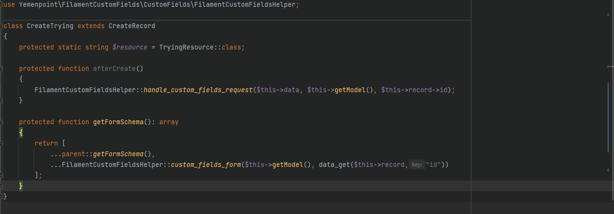
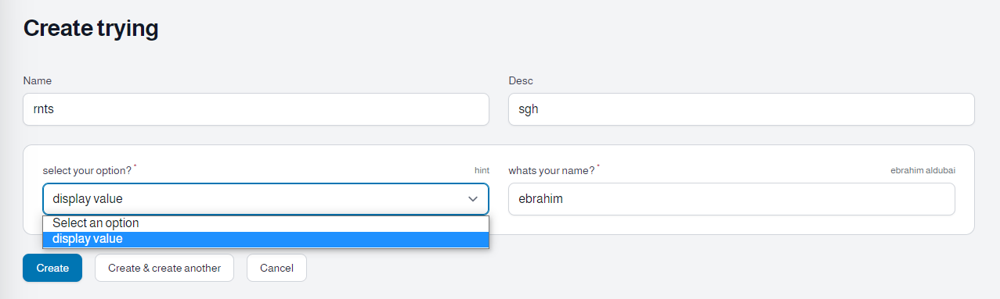
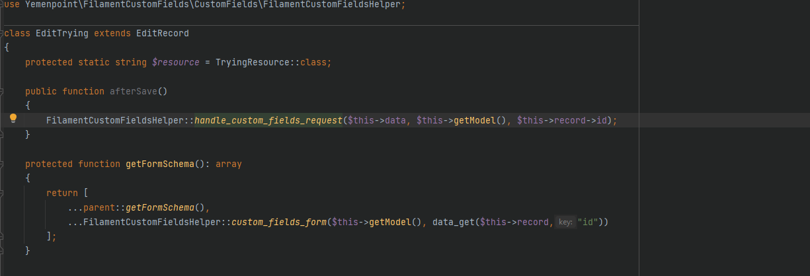
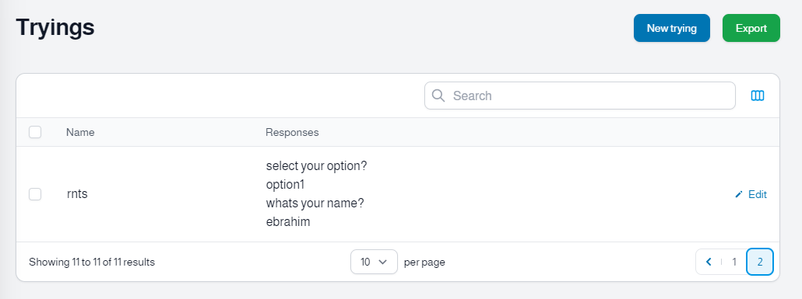
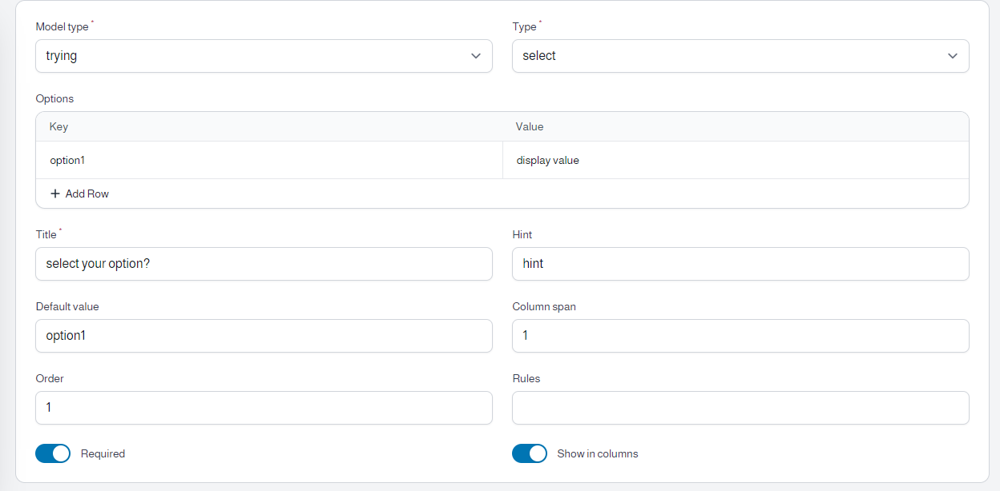
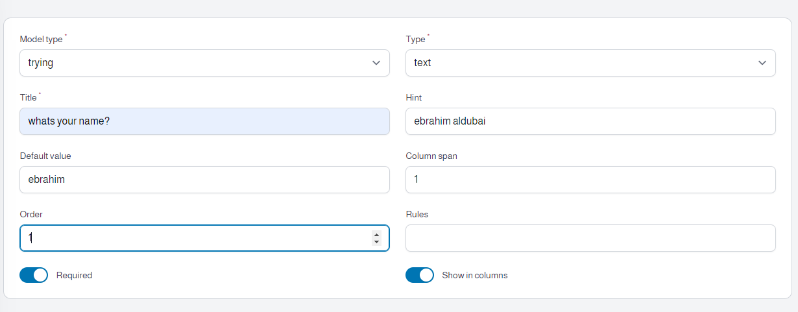
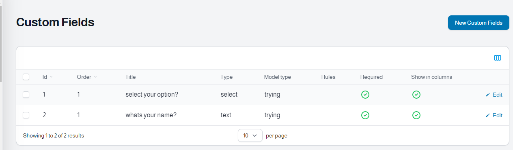
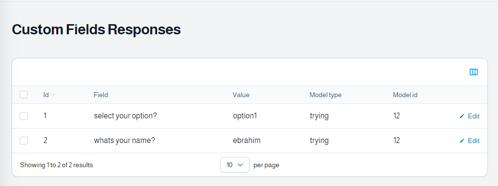

# Filament Custom Fields 

## Installation

You can install the package via composer:

```php
composer require codions/filament-custom-fields
```

Optionally, you can publish config and migration using

```php
php artisan vendor:publish --tag="filament-custom-fields-migrations"
php artisan vendor:publish --tag="filament-custom-fields-config"

//then migrate
php artisan migrate

```
### Config
#### filament-custom-fields.php
```php
<?php

use Codions\FilamentCustomFields\Resources\CustomFieldResource;
use Codions\FilamentCustomFields\Resources\CustomFieldResponseResource;

return [
    'resources' => [
        CustomFieldResource::class,
        CustomFieldResponseResource::class,
    ],
    //model options will appear in CustomFieldResource 
    'models' => [
//        \App\Models\Trying::class => "trying",
    ],
    
    "navigation_group" => "Custom Fields",
    "custom_fields_label" => "Custom Fields",
    "custom_field_responses_label" => "Custom Fields Responses",
];

```

## Usage

### CreateRecord Page
<div align="center">
    
</div>
<br/>

<div align="center">
    
</div>
<br/>

```php
use Codions\FilamentCustomFields\CustomFields\FilamentCustomFieldsHelper;


    protected function afterCreate()
    {
        FilamentCustomFieldsHelper::handleCustomFieldsRequest($this->data, $this->getModel(), $this->record->id);
    }

    protected function getFormSchema(): array
    {
        return [
            ...parent::getFormSchema(),
            ...FilamentCustomFieldsHelper::customFieldsForm($this->getModel(), data_get($this->record,"id"))
        ];
    }


```

### EditRecord Page
<div align="center">
    
</div>
<br/>

```php
use Codions\FilamentCustomFields\CustomFields\FilamentCustomFieldsHelper;

    public function afterSave()
    {
    //this will handleCustomFieldsRequest
        FilamentCustomFieldsHelper::handleCustomFieldsRequest($this->data, $this->getModel(), $this->record->id);
    }

    protected function getFormSchema(): array
    {
        return [
            ...parent::getFormSchema(),
            ...FilamentCustomFieldsHelper::customFieldsForm($this->getModel(), data_get($this->record,"id"))
        ];
    }
```

### Then add Column to see values

<div align="center">
    
</div>
<br/>

```php
    use Codions\FilamentCustomFields\CustomFields\FilamentCustomFieldsHelper;


   // show CustomFieldResponses in Resource column
    public static function table(Table $table): Table
    {
        return $table
            ->columns([
                FilamentCustomFieldsHelper::customFieldsColumn()
            ]);
    }
```
## Images

<div align="center">
    
</div>
<br/>
<div align="center">
    
</div>
<br/>
<div align="center">
    
</div>
<br/>
<div align="center">
    
</div>
<br/>
<div align="center">
    
</div>
<br/>

####  

## Credits

- [yemenpoint](https://github.com/yemenpoint)

## License

The MIT License (MIT). Please see [License File](LICENSE.md) for more information.
